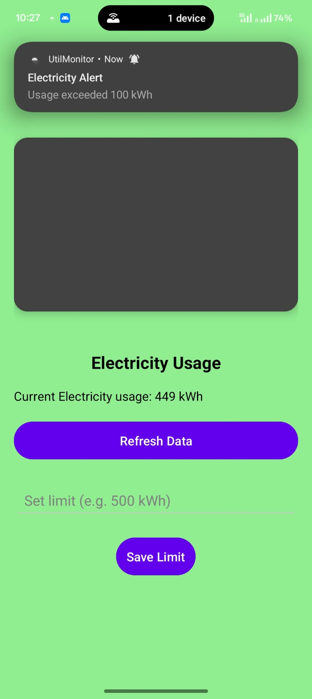

# UtilMonitor

## Description
UtilMonitor is an Android app designed to track electricity, water, and gas usage.

## Screenshots

### Splash Screen

### Main Page

### Electricity Page

### Water Page

### Gas Page

### Usage History

